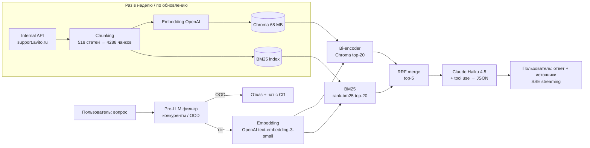

# А-Помощь — AI Overview по справке Авито

> На support.avito.ru 518 статей, поиск ловит слова, а не смысл (запрос «кинули с доставкой» возвращает нужную статью на 13-й позиции). А-Помощь принимает вопрос человеческим языком и за ~5 секунд возвращает структурированный ответ со ссылками на источники. Recall@5 = 0.854, Faithfulness = 0.74, Refusal rate = 1.0 на размеченном датасете, $0.0068 за запрос.

### 👉 [Попробовать вживую — avi-help.vercel.app](https://avi-help.vercel.app/)

Как пройти демо за 30 секунд:

1. **[Открыть прод](https://avi-help.vercel.app/)** — фронт на Vercel, бэкенд на Railway, прогрев ~5 сек на холодном старте.
2. **Задать вопрос** — например, «как вернуть деньги если продавец не отвечает» или «приехал телефон со сколом». Можно с опечатками («верниите деньги») или сленгом («обяв», «лк»).
3. **Через ~150 мс** появятся пилюли источников, через ~5 с — полный ответ стримом.
4. **Проверить отказ** — спросить «погода в Москве»: A-Помощь корректно откажется отвечать (Refusal rate = 1.0 на 20 OOD-вопросах).
5. **Открыть [/admin](https://avi-help-production.up.railway.app/admin)** (нужен токен) — дашборд с поиск-скорами, latency, токенами, стоимостью каждого запроса.

## 🎯 Проблема

Поиск на support.avito.ru ловит слова, а не смысл, и валит релевантную статью вниз выдачи. На запрос «кинули с доставкой» нужная статья «Как не попасться мошенникам» — на 13-й позиции. На «что делать если заблокировали аккаунт без причины» — на 12-й. Однословный «отзыв» возвращает 20 заголовков, начинающихся со слова «Отзыв». «Безопасная сделка» перемешивает 3 разные сущности (общие правила, платный продукт, вход по СМС). Каждый раз, когда пользователь не нашёл ответ, он идёт в чат с поддержкой — это нагрузка на агентов СП. По воронке TAM/SAM/SOM реалистичный потолок экономии — ~6.3 млн руб./год при helpful rate 50% и стоимости часа агента 595 руб.

## 💡 Решение

Вопрос → pre-LLM фильтр (конкуренты / OOD) → embedding (OpenAI) → параллельно bi-encoder (Chroma top-20) и BM25 (top-20) → RRF merge top-5 → Claude Haiku 4.5 с tool use отдаёт структурированный JSON со стримингом. Если в индексе ответа нет — вежливый отказ с предложением чата с поддержкой. 6 спринтов, раздельный замер эффекта каждой правки, 8 из 9 целей PRD закрыто.

- **Гибридный поиск (BM25 + bi-encoder + RRF) вместо чисто векторного** — векторный поиск промахивался на точных запросах с конкретными терминами. Добавление лексического канала и слияние через Reciprocal Rank Fusion подняло Recall@5 с 0.81 до 0.85 при том же P95.
- **Tool Use от Claude вместо парсинга markdown** — раньше Claude отдавал ответ markdown-текстом, регулярки доставали краткий ответ, секции и источники, и в 5% случаев парсер ломался (модель забывала заголовок или меняла формат). Перешла на JSON-схему через Anthropic tool use — Anthropic у себя гарантирует валидную структуру, доля сломанных ответов упала до нуля.
- **Cross-encoder reranker протестировала и откатила** — на eval давал Recall@5 +7.3 п.п. (0.81 → 0.89), но в проде на бесплатном CPU Railway добавлял 8500 мс к latency (на локальном M1 — всего 200 мс). При развёртывании внутри Авито обязательно бы оставила, но в демо-MLP скорость важнее.
- **LLM-as-judge с переписанным промптом** — первая версия Sonnet-судьи врала: в комментариях «всё ок, подкреплено», в финальном вердикте — «врёт». Из-за этого Faithfulness казался 0.45, реально ~0.7. Починила промпт судьи, метрика выросла до 0.74.
- **Стриминг SSE** — пилюли источников появляются за 151 мс, первое слово ответа ~1.5 с, полный ответ ~5 с. UX плавнее, чем длинное ожидание спиннера.
- **In-memory обработка + хеширование IP в логах** — текст запроса логируется для офлайн-анализа метрик, IP хешируется с солью. Логи в JSONL, отдельный админ-дашборд с поиск-скорами, latency, токенами, стоимостью каждого запроса.

## 🏗 Архитектура

Офлайн-часть независима от онлайна: индекс пересобирается одним скриптом за ~2 минуты, стоимость пересбора $0.025. 4288 чанков из 518 статей живут в Chroma как 1536-мерные векторы, BM25 поднимается в RAM из Chroma за ~1.5 с при старте бэкенда. Запрос и чанки находятся в одном векторном пространстве (multilingual-эмбеддинг работает на русском из коробки).

## 📊 Метрики и результаты

Замер офлайн на 100 in-domain + 20 OOD вопросах. In-domain покрывают топ-категории справки (безопасность, доставка, оплата, объявления, профиль). Стиль формулировок — как у реальных пользователей: разговорный, с опечатками, со сленгом. Эталонные статьи проставлены вручную, глубина K=5 соответствует количеству чанков, подаваемых в LLM.

| Метрика | Цель | Факт | Как мерил |
|---|---:|---:|---|
| Recall@5 | ≥ 0.85 | **0.854** | Доля запросов, где эталонная статья в топ-5 поиска |
| MRR@10 | ≥ 0.6 | **0.702** | Средняя обратная позиция первого эталона |
| Faithfulness | ≥ 0.7 | **0.74** | LLM-judge (Sonnet 4.6): подкреплены ли утверждения источниками |
| Relevance avg | ≥ 4 | **4.70** | LLM-judge (Sonnet 4.6): адресует ли ответ заданный вопрос (1–5) |
| Refusal rate | 1.0 | **1.0** | Доля корректных отказов на 20 OOD-вопросах |
| Latency до источников | ≤ 500 мс | **151 мс** | TTFB пилюль источников на проде |
| Latency P50 / P95 | ≤ 5 / 8 с | **4.8 / 7.3 с** | Полный ответ end-to-end, прод |
| Cost per query | ≤ $0.005 | $0.0068 ❌ | Haiku $0.00577 + embedding $0.00001 + погрешность |

Generation занимает 87% latency (Haiku ~4170 мс из 4800 мс P50) — дальше без архитектурных изменений не оптимизируется. Стоимость — единственный недобор: решается промт-кешингом Anthropic (90% скидка на статичную часть промпта, потолок $0.001–0.002).

ROI юнит-экономики: каждый запрос стоит ~0.5 руб., снимает ~15 руб. агентского времени (1.5 мин × 595 руб./ч). На рубль API возвращается ~15 руб. экономии. На горизонте года в реалистичном сценарии (SOM 450 тыс обращений) — ~6.3 млн руб. чистой экономии.

Продуктовые метрики (Resolution Rate, Escalation Rate, Reformulation Rate, Helpful Rate) **не замерены** — нет реального трафика и интеграции с ATS Авито. Цели проставлены из индустриальных бенчмарков, прямой замер — после A/B-теста.

## 🔧 Стек и обоснования

| Технология | Роль | Почему |
|---|---|---|
| **FastAPI + async SSE** | Backend API | Async I/O нужен для стриминга ответа Haiku кусками — пользователь видит первое слово через ~1.5 с, не через 5 с |
| **Claude Haiku 4.5 + tool use** | Генерация ответа | Дёшево, быстро (~4 с на ответ), tool use гарантирует валидный JSON вместо парсинга markdown регулярками |
| **OpenAI `text-embedding-3-small`** | Embeddings запросов и чанков | Multilingual из коробки, корректная семантическая близость на русском; одна и та же модель для индекса и запросов |
| **ChromaDB** | Vector store | Локальный inference без сетевых походов, sqlite на диске (68 MB на 4288 чанков); для текущего объёма Qdrant/Pinecone избыточны |
| **rank-bm25** | Лексический поиск | In-RAM, пересобирается из Chroma за 1.5 с при старте бэкенда. Закрывает промахи bi-encoder на точных терминах |
| **RRF (Reciprocal Rank Fusion)** | Слияние bi + BM25 | Без обучаемых весов, устойчив к разным шкалам скоров двух ретриверов |
| **Claude Sonnet 4.6** | LLM-as-judge (только в eval) | В проде не используется; нужен только для офлайн-замера Faithfulness и Relevance — Haiku-судья был бы недостаточно строгим |
| **Vite + React** | Frontend | ~107 KB gzipped, нативный fetch + ReadableStream для SSE без зависимостей |
| **Railway + Vercel** | Deploy | Бэкенд с persistent volume под Chroma и JSONL-логи, фронт на edge — без DevOps-возни |

## 🤔 Trade-offs и что бы сделала иначе

### От чего сознательно отказалась

- **Cross-encoder reranker.** На eval давал Recall@5 +7.3 п.п. и MRR@10 +5.98 п.п., но на бесплатном CPU Railway добавлял 8500 мс к latency (на M1 — 200 мс). В реальном проекте внутри Авито обязательно бы оставила (мощности есть), в демо-MLP скорость важнее.
- **Авторизация и сохранение запросов под пользователем.** MLP под one-shot демо. Текст запроса логируется в JSONL для офлайн-анализа метрик, IP хешируется с солью — приватность бесплатно, аккаунты не нужны.
- **Fine-tune эмбеддингов.** На 100 размеченных вопросах fine-tune переобучит модель сильнее, чем поднимет качество. Сначала собрать feedback-лог из прода (≥1000 пар «запрос → нажатая статья»), потом думать.
- **A/B-тест в MLP.** Нет интеграции с реальным саппортом Авито — нет ground truth для Resolution Rate и Escalation Rate. Без этого продуктовые метрики только косвенные, имитировать смысла нет.
- **Детектор prompt injection.** Системный промпт явно игнорирует «забудь предыдущие инструкции», но отдельного классификатора нет. Для пет-проекта приемлемо, для боевого запуска — P1.
- **Аудит на предвзятость (формальный/разговорный, грамотный/с опечатками).** На MLP не проведён. Для развёртывания в Авито — блокер раскатки (юридическая ответственность работодателя), для пет-проекта — отложено.

### Что бы сделала иначе зная сейчас

- **Сразу планировать датасет под анализ ошибок, а не под общий замер.** 100 in-domain хватило показать, что hybrid побеждает чистый bi-encoder, но статистика на n=10–15 на категорию шумная. Если бы переделывала — стартовала бы с 30 вопросов на категорию (300+ total), даже если это +2 дня на разметку.
- **Поставить prompt caching Anthropic с первого дня.** 90% скидка на статичную часть промпта — мелочь при текущем трафике, но это закрывает единственный недобор по PRD-цели стоимости ($0.0068 → $0.001–0.002). Включается одним параметром, я пожалела времени на настройку.
- **Cross-encoder протестировать на платном CPU, а не откатывать.** Откатила после прод-замера на бесплатном тире Railway, где latency взлетела до 24.3 с. На платном CPU или GPU latency была бы приемлемой, и Recall@5 был бы 0.89 вместо 0.85. Урок: сначала проверять, упирается ли узкое место в железо или в архитектуру.
- **LLM-judge — писать промпт судьи параллельно с промптом генератора.** Из-за бага в judge-промпте Faithfulness две недели казался 0.45, и я пыталась чинить генератор. Когда переписала промпт судьи — выяснилось, что реальный Faithfulness уже был ~0.7. Урок: судью валидировать на ручной выборке прежде, чем верить его цифрам.

## 📎 Контекст

*Некоммерческий пет-проект для портфолио. Использованы публичные данные [support.avito.ru](https://support.avito.ru) для демонстрации ML-продукта. Фокус на продуктовых решениях вокруг RAG, офлайн-оценке качества ранжирования и экономике LLM-продукта. Полный ML Deep Dive — в [docs/AI Overview. ML Deep Dive Document.md](docs/AI%20Overview.%20ML%20Deep%20Dive%20Document.md).*
